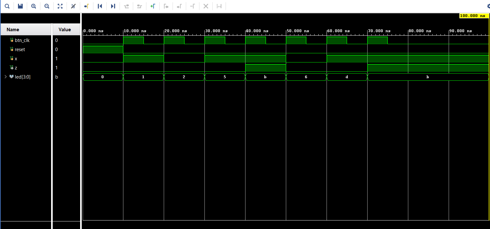
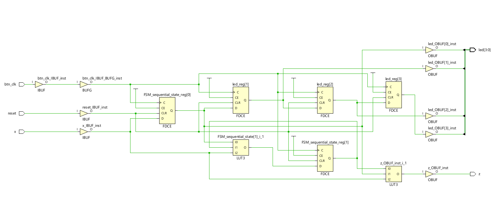

# Sequence Detector (1011)

A Verilog implementation of a Mealy Finite State Machine (FSM) to detect the binary sequence **1011** with support for overlapping occurrences. The design is verified using simulation and synthesized to observe the RTL structure.

---

## Overview

This project detects the sequence `1011` in a serial input stream. When the sequence is identified, the output signal `z` is asserted high for one clock cycle. The design supports overlapping sequences, ensuring no valid pattern is missed.

---

## Design Details

* **FSM Type:** Mealy Machine
* **Input:** Serial binary stream (`x`)
* **Clock:** Button-controlled clock (`btn_clk`)
* **Reset:** Asynchronous reset
* **Output:**

  * `z` → High when sequence `1011` is detected
  * `led[3:0]` → Displays last 4 input bits (shift register behavior)

---

## State Description

| State | Description    |
| ----- | -------------- |
| S0    | Initial state  |
| S1    | Detected `1`   |
| S2    | Detected `10`  |
| S3    | Detected `101` |

---

## Working Principle

* The FSM transitions through states based on input `x`
* When the system reaches state `S3` and input is `1`, sequence `1011` is detected
* Output `z` is asserted immediately (Mealy output)
* Overlapping sequences are handled automatically by state transitions

---

## Simulation

Test input sequence:

```text id="simseq"
1011011
```

Expected behavior:

* Output `z` becomes high when `1011` is detected
* Overlapping detection is supported

---

## Waveform



---

## RTL Diagram



---

## File Structure

```text id="filestruct"
sequence_detector.v        # FSM design (Verilog)
tb_sequence_detector.v     # Testbench
waveform.png               # Simulation output
rtl_diagram.png            # RTL schematic
README.md                  # Documentation
```

---

## How to Run

1. Open the project in a Verilog simulator (Vivado/ModelSim)
2. Compile:

   * `sequence_detector.v`
   * `tb_sequence_detector.v`
3. Run simulation
4. Observe waveform to verify output behavior

---

## Key Features

* Sequence detection using Mealy FSM
* Supports overlapping patterns
* Synthesizable design
* Verified through simulation
* RTL schematic available for hardware understanding

---

## Applications

* Pattern detection in digital communication
* Control logic in embedded systems
* Signal processing pipelines
* Fundamental FSM design reference

---
